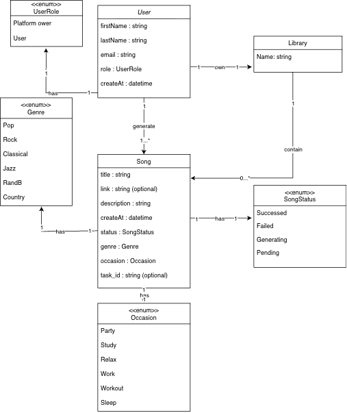
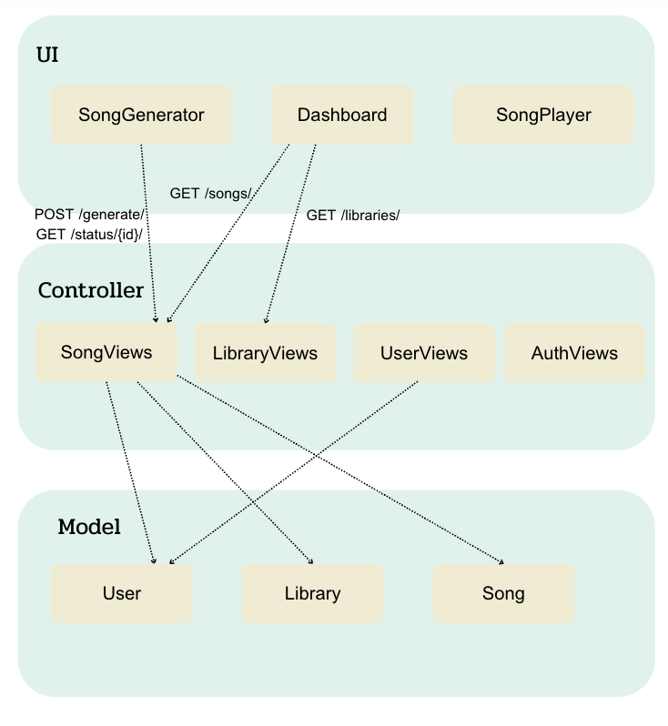
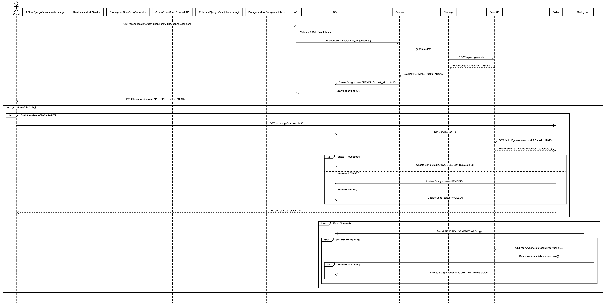
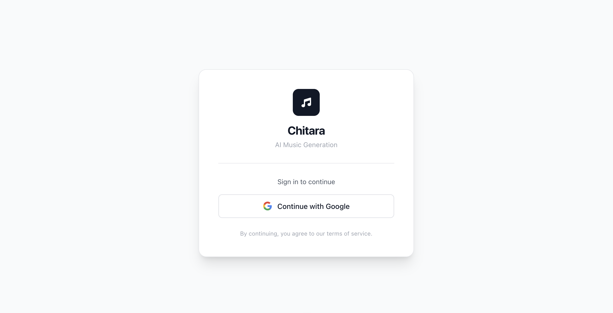
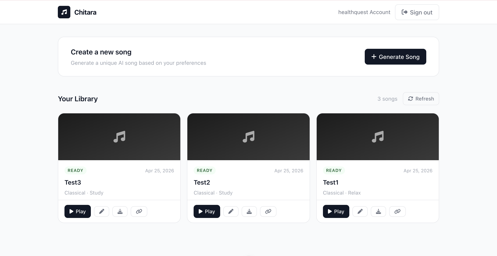
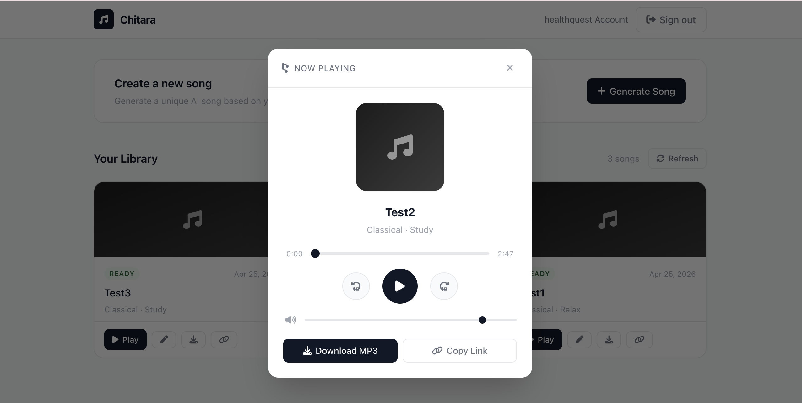

# Chitara - Music Platform API

A Django REST Framework API for managing music, users, and libraries.

### Set up

### 1. Clone & Setup Environment

```bash
git clone https://github.com/Fahsairvw/Chitara.git
cd Chitara
```

### 2. Setup .env File

Copy the example file and fill in your values:

```bash
cp .env.example .env
```

Then edit `.env` with your configuration:

```env
# Choose mode: "mock" or "suno"
GENERATOR_STRATEGY=mock

# Only needed if using suno mode:
SUNO_API_KEY=your_api_key_here

# Google OAuth credentials
CLIENT_ID=your_google_client_id
CLIENT_SECRET=your_google_client_secret
GOOGLE_REDIRECT_URI=http://localhost:8000/api/auth/google/callback/

# Frontend URL
FRONTEND_URL=http://localhost:5173
```

### 3. Setup Backend

```bash
# Create virtual environment
python -m venv .venv
source .venv/bin/activate  # On Windows: .venv\Scripts\activate

# Install dependencies
cd backend
pip install -r requirements.txt

# Apply migrations
python manage.py migrate

# Create admin account (optional)
python manage.py createsuperuser
```

### 4. Setup Frontend

```bash
# Navigate to frontend directory
cd frontend

# Install dependencies
npm install
```

## Running the Frontend

To start the frontend development server:

```bash
cd frontend
npm run dev
```
The application will be available at `http://localhost:5173`. Make sure the backend is also running so that API requests succeed.


## Running the Backend

### Mock Mode (Testing/Development)
```bash
cd backend
python manage.py runserver
```
The server will start at `http://127.0.0.1:8000/`

**Mock mode features:**
- Instant song generation
- No API key needed
- Returns fake songs

### Suno Mode (Real AI Generation)

**Step 1: Get Suno API Key**
- Visit: https://www.sunoapi.org/
- Sign up and get your API key
- Add to `.env`: `SUNO_API_KEY=your_key_here`

**Step 2: Update .env**
```bash
GENERATOR_STRATEGY=suno
SUNO_API_KEY=your_suno_api_key_here
```

**Step 3: Run Backend**
```bash
cd backend
python manage.py runserver
```

**Suno mode features:**
- Real AI-generated songs
- Requires API key
- Returns actual audio URLs
- Songs take time to generate

## Google OAuth Setup Guide

1. **Create Project & Consent Screen**: Go to [Google Cloud Console](https://console.cloud.google.com/), create a project, and set up the OAuth consent screen (External, add `openid`, `email`, `profile` scopes).
2. **Create Credentials**: Go to **Credentials > Create Credentials > OAuth client ID** (Web application). Add `http://localhost:8000/api/auth/google/callback/` to **Authorized redirect URIs**.
3. **Configure Environment**: Copy your Client ID and Client Secret, then update your `.env` file:

```env
CLIENT_ID=your_client_id_here
CLIENT_SECRET=your_client_secret_here
GOOGLE_REDIRECT_URI=http://localhost:8000/api/auth/google/callback/
FRONTEND_URL=http://localhost:5173
```

## How Song Generation Works

### Mock Mode
1. You create a song → API returns instant success
2. Song status: `"Succeeded"`
3. URL: `https://example.com/mock-song.mp3` (fake)

### Suno Mode
1. You create a song → API sends to Suno AI
2. Song status: `"PENDING"` + `task_id` received
3. Background job checks Suno API every 30 seconds
4. When ready, status → `"Succeeded"` + real audio URL

### Check Song Status
```bash
# Check if song is ready (works in both modes)
curl http://localhost:8000/api/songs/status/{task_id}/

# Response:
{
  "song_id": 1,
  "status": "Succeeded",
  "link": "https://audios.suno.ai/...",
  "api_response": { ... }
}
```

Here is a link of CRUD, suno api and mock evidence
https://docs.google.com/document/d/1byFzzkw_89gAtEnHXGaNv5JHO6FOuWLFFedegcLajpE/edit?usp=sharing

## Architecture Diagrams

### Domain Model Diagram
This diagram shows the core entities (Models) and their relationships within the database layer.




### MVT Architecture Class Diagram
This diagram outlines how the system applies the Model-View-Template architecture, utilizing Vue.js for the Templates layer and Django REST Framework for Models and Views.



### Song Generation Sequence Diagram
This sequence diagram details the asynchronous song generation process, including the API integration strategy and the polling mechanisms.



## Application Screenshots

### Login Page


### Library Page


### Song Detail
